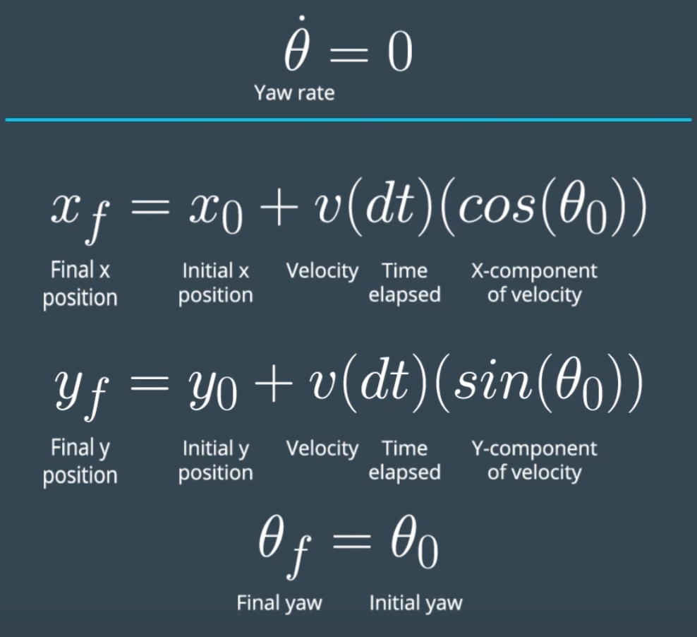
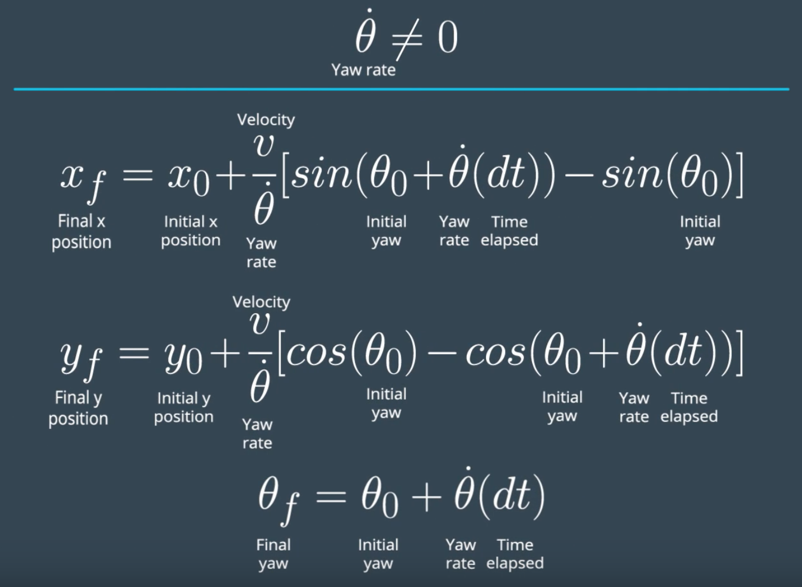

# CarND-Controls-MPC

Self-Driving Car Engineer Nanodegree Program

This project implements a Model Predictive Control algorithm to estimate the steering angle and throttle of a moving vehicle knowing vehicle desired waypoints.

---

#### Basic Build Instructions

1. Clone this repo.
2. Make a build directory: `mkdir build && cd build`
3. Compile: `cmake .. && make`
4. Run it: `./mpc`.

### Project Overview

The project contains the following files:
1. [main.cpp](src/main.cpp) is the entry point of the application, it contains message handler functions to communicate with the simulator;
2. [MPC.h](src/MPC.h) is a header file with the declaration of the `MPC` class;
3. [MPC.cpp](src/MPC.cpp) contains implementation of the `MPC` algorithm.

### Control flow

#### Get inputs from the simulator

The control flow starts in the handler `h.onMessage` (file main.cpp, line 89). The function gets telemetry data (lines 105-115) from the simulator.

Telemetry data includes:
1. `"ptsx"`, `"ptsy"` — the path car has to follow
2. `"px"`, `"py"` — current vehicle position
3. `"psi"` — current vehicle orientation
4. `"speed"` — current vehicle speed
5. `"steering_angle"` — current vehicle steering angle (in radians)
6. `"throttle"` — current vehicle throttle

#### Preprocess the data

Telemetry data is passed in global coordinates, the first step is to convert the waypoints `ptsx` and `ptsy` from global coordinates system to car coordinates (lines 119-126).

#### Fit a polynomial, compute state and error

The next step is to fit a polynomial to approximate the path (lines 129-131). After that vehicle state and error is computed (lines 140-165) which includes position, orientation, speed, cross-track error and orientation error.

#### Compute control values

State is passed to function `MPC::Solve` (line 174) that returns control vector with values for steering angle and throttle. Steering angle is normalized to [-1, 1] range (line 184).

### Model

The `MPC` class implements Model Predictive Control algorithm which takes vehicle state and polynomial as inputs and computes control values for steering angle and throttle as output.

#### Function MPC::Solve

The main function of the class is `Solve` (file MPC.cpp, lines 159-287).

The function starts with decomposing vehicle state vector `state` into separate variables `x`, `y`, `psi`, `v`, `cti`, `epsi` (lines 163-168).

The function sets `n_vars` to the number of model variables to `6 * N + 2 * (N - 1)` and number of constraints to `6 * N` where `6` is the number of elements in the state vector, `2` is the number of control values and `N` is the number of timesteps (defined as constant in line 8).

Initial values of variables are set to `0` except initial state (lines 181-192). The lower and upper bounds are set to `[-1e19, 1e19]` for variables, `[-0.436332, 0.436332]` for steering angle `delta` (corresponds to [-25, 25] degrees) and `[-1, 1]` for throttle or acceleration `a` (lines 198-213). Lower and upper bounds for constraints are initialized with `0` except initial state (lines 217-236).

`FG_eval::operator()` is called to compute objective and constraints (line 239).

Finally IPOPT solver is used to find the values of control variables (lines 241-265). The status of the solver process is checked to be `success`, in case the solver fails the whole program terminates (lines 268-269).

The values of control variables are returned as vector elements (lines 281-286).

#### Function FG_eval::operator()

FG_eval::operator() is the other part of the MPC algorithm which computes objective and constraints. It starts with initializing the cost with `0` (line 55), then iterates over `N` sets of variables and updates the cost with:
1. Squared distance between the current speed and the target speed (line 71).
1. Squared distance between the value of CTE at time `t` and the value of CTE at time `t-1`, computed for t > 0 (line 77).
1. The product of speed and squared steering angle divided by `(1 + t * 0.2)`, computed for t < N-1 (line 84).

Each part of the cost is described below.

##### Speed not equal to reference

Speed not equal to reference is penalized by adding `CppAD::pow(v - ref_v * vmult, 2) * lambda_dvref` to the cost. Here reference speed `ref_v` is multiplied by hyperparameter `vmult`. The reason for that is that the target speed is set to 100 mph in the project, however the simulator can accelerate the car slightly above that.

The cost is computed as a squared distance, which means it's positive both when speed is below the target and when it's above the target. If speed is below the target the cost drives the computed speed value up, since with the increased speed this part of the cost goes down.

When the speed exceeds 100 mph the speed part of the cost starts increasing, and the MPC algorithm produces a negative value of throttle, causing the vehicle to break. Setting the target speed to a larger value than 100 mph results in a steady acceleration, as opposed to acceleration and then breaking at >100 mph.

This approach would of course be unacceptable in real life.

##### CTE increase

The next part penalizes divergence from the optimal track by adding `(CppAD::pow(cte, 2) - CppAD::pow(cte0, 2)) * lambda_dcte` to the cost. An alternative to this type of penalty would be to add a squared value of the CTE to the cost. An observation has been made during experimentation that the CTE alone is more prone to a wobbly driving then a CTE increase.

##### High-speed turns

High-speed turns are penalized by adding `v * CppAD::pow(delta, 2) * lambda_v_delta / (1 + t * 0.2)` to the cost. The value of `v` is positive when the vehicle moves forward. A tendency to move backwards that could be produced by optimizing towards negative values of `v` is counterbalanced by the first part of the cost "speed not equal to reference". Not raising speed to the power of 2 penalizes a speed increase less than a delta increase.

The purpose of the denominator `(1 + t * 0.2)` is to penalize high-speed turn parts of the trajectory that are further away from the vehicle position slightly less than those that are close to the current vehicle position. The intention is to let the vehicle decrease the speed more aggressively while cornering, but be less aggressive with breaking or even accelerate when exiting turns.

#### Hyperparameters

Each part of the cost is multiplied by appropriate lambda value which are hyperparameters to tune: `lambda_dvref`, `lambda_dcte` and `lambda_v_delta`. Additional hyperparameter to tune is tartet speed multiplier `vmult`.

#### CV vs CTRV Model

Setting the `kCtrvModel` (file MPC.cpp, line 26) constant to `true` switches from the CV model to the CTRV when predicting position.

CV model:

CTRV model:

The changes are applied to predicting the vehicle position for the duration of latency (file main.cpp, lines 144-151) and to setting model constraints (file MPC.cpp, lines 135-142).

Enabling CTRV model doesn't bring the vehicle noticeably closer to the ideal path, however the car starts wobbling around the center of the track (yellow line). Limited attempts to tune the hyperparameters did not improve the behavior. The CTRV model is turned off in the final submission since the vehicle behavior is satisfactory for the project with the CV model.

#### Model complexity

An observation has been made while working on the project that a simple model often produces a more predicted and explainable behavior than a complex model with many components to the cost function. Earlier experiments with the model performed while working on the project included more complex models with up to 5-7 elements of the cost function. The vehicle behavior was often erratic. Also, a simpler model has less hyperparameters and is easier to tune. Therefore the final model deliberately uses only 3 cost components.

### Timestep Length and Elapsed Duration

Temestep is defined in variable `dt` (MPC.cpp, line 9). Number of steps is defined in constant `N` (MPC.cpp, line 8).

The project has been tested with values of `dt` ranging from 0.025 to 0.2 and values of `N` ranging from 5 to 20. Final selected values are `dt=0.05` (50 milliseconds) and `N=10`.

With the selected values the predicted part of the car trajectory spans 1/2 of a second. Shorter span of the predicted trajectory doesn't allow to compute accurate enough control values to keep the car on its path. Longer prediction period increases the time of computation without giving a benefit.

Similarly, increasing the timestep to 100 ms results in a decreased stability of the car. Decreasing the timestep to 25 ms increases the amount of computation without providing a clear benefit to the accuracy.

### Latency

The control latency is simulated in the application by calling `this_thread::sleep_for` with parameter 100 ms. (file main.cpp, line 236). To account for the latency, the program predicts future vehicle state and error, and uses predicted state values as inputs for `MPC::Solve`. This way, when control values are applied, the vehicle reaches the predicted state (with a certain probability).

The value of control latency used for computations is defined by the `controls_latency_sec` constant (line 13).

#### Predict future vehicle state

Future vehicle state is predicted by applying motion model to the current state and using the value of latency as the time distance for prediction. The program predicts vehicle position, speed and direction (lines 140-154).

#### Predict future error

The program computes the current state error (lines 157-158). Current error and predicted state is used to predict future error (lines 161-162).

#### Latency of computation

An attempt was made to account for the time it takes `MPC::Solve` to compute the values of control variables. To do that, the program measures time of `Solve` (file main.cpp, lines 173, 175-176). The time is accumulated in variable `solve_time` (defined in line 16), number of calls to `Solve` made so far is saved in variable `solve_count` (defined in line 19). Only the fist 100 calls are measured (lines 179-181).

Measured time is averaged and added to the value of control latency (lines 134-137).

The effect of accounting for computation latency hasn't been clearly observed.

### Video Files

Two video file are available:
1. Car driving 2 laps around the track with yellow line indicating the center of the track and green line indicating predicted car trajectory: [media/2laps.mov](media/2laps.mov)
2. Car driving 2 laps around the track without trajectory lines drawn: [media/2laps-no-trajectory.mov](media/2laps-no-trajectory.mov)